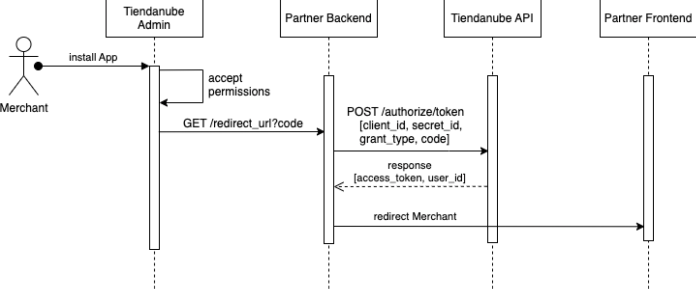
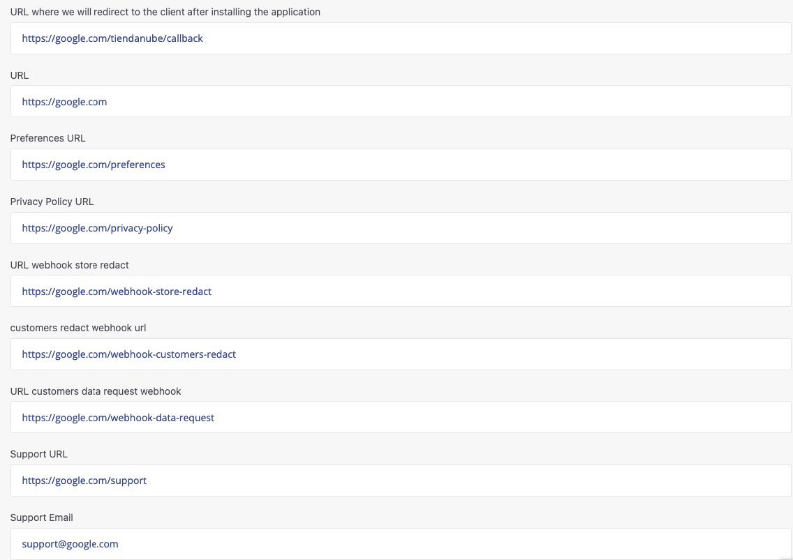

We provide authorization and user authentication by a restricted form of OAuth 2. In a glance:

- The only grant type we support is the ["authorization code"](https://oauth.net/2/grant-types/authorization-code/) one.
- Our [access tokens](https://oauth.net/2/access-tokens/) don't expire. They become invalid only after you get a new one, or if the user uninstalls your app.
- Along with the access token we provide an `user_id`, which is the ID of the store. This is key: you need it for making requests to our API. It is also useful for authenticating app users on your website (see User authentication).

## Introduction

When creating an app, you'll be prompted to complete some information regarding your application URLs ([see URLs](https://github.com/TiendaNube/api-docs/blob/master/resources/authentication.md#urls)). You also have to select the scopes your App needs and set a redirection URL, which is the URL where we will redirect the client once the application is installed. The scopes specify the resources for which the app is asking authorization of its users ([see Scopes](https://github.com/TiendaNube/api-docs/blob/master/resources/authentication.md#scopes)). The redirection URL is used as part of the authorization flow (see below). Check out this [video](https://www.loom.com/share/91a7a5aa56384fdca9519220d80f5db7) where we show how the authorization process works here in Tiendanube.

## Authorization flow

The authorization flow is pretty standard, except for the first step:



1. The user, from his Tiendanube/Nuvemshop admin, clicks on a button to install your app. Or, alternatively, he goes to https://www.tiendanube.com/apps/(app_id)/authorize (if he is not logged in, he is prompted to do so).
2. He is redirected to a page where he has to authorize the scopes your app needs (if he has already done it, this step is skipped).
3. He is redirected to your app's redirection URL with an authorization code, which expires in 30 seconds.
4. Using your app's credentials and the authorization code, you can obtain an access token by making a POST request to https://www.tiendanube.com/apps/authorize/token. (Don't forget to also send `grant_type=authorization_code`, see the example below).

Note: Any of these URLs in the tiendanube.com domain can be replaced for identical ones in the nuvemshop.com.br domain.

#### Example

Asume that your app has:

- id = 123
- redirection URL = https://www.example.com/
- scopes = `read_orders`, `write_products`
- client_secret = abcdef

1. Store with ID 789 goes to https://www.tiendanube.com/apps/123/authorize?state=csrf-code
2. User accepts.
3. He gets redirected to https://www.example.com/?code=xyz&state=csrf-code.
4. Then you do:

```sh
curl -d '{"client_id": "0000", "client_secret": "xxxxxxxx", "grant_type": "authorization_code", "code": "xxxxxxxx" }' \
-X POST "https://www.tiendanube.com/apps/authorize/token"
```

and receive:

```json
{
  "access_token": "61181d08b7e328d256736hdcb671c3ce50b8af5",
  "token_type": "bearer",
  "scope": "read_orders,write_products",
  "user_id": "789"
}
```

> At some requests, you will get the response with a `store_id` field containing the data of `user_id`

## URLs

Your application URLs are important to provide the best Merchant/Consumer experience while using our platform. All of them are required.



- **URL where we will redirect to the client after installing the application:** URL to which the user will be redirected after installing the App. This is your callback URL. You must use it to get the authorization code and generate the access token as explained above (see Authorization Flow).

- **URL:** URL of your admin panel that the user will access to use the application. For example, the first page the user sees after logging in your application.

- **Preferences URL:** URL to your app's page where the user can configure the App's settings. Some examples: Payments - set up installments for credit card purchases. Shipping - configure which shipping methods will be available to consumers. Marketing - modification of the Scripts inserted in the page.

- **Privacy Policy URL:** this URL is displayed in the App Details Page. Works as a transparency tool between company and user.

- **URL Webhook Store Redact:** store data deletion requests. This Webhook will only be triggered if the Merchant requests that the store data be deleted through the admin panel.

- **URL Webhook Customer Redact:** consumer data deletion request. This Webhook will only be triggered if the Merchant requests that the customer data be deleted through the admin panel.

- **URL Customers Data Request Webhook:** request to receive a user's stored data report.

- **Support URL:** URL where the user will be redirected when they need help. This could be a self-service support page or contact form. If the Support URL is empty, then the Merchant will be redirected to the support email.

- **Support Email:** contact email for support where App users can contact.

## Scopes

Apps should only ask for the access scopes they need. If an app only needs to read products, it should only ask for the `read_products` scope.

**If you ask for any write scope, the read scope is implied.**

As [Webhooks](https://github.com/TiendaNube/api-docs/blob/master/resources/webhook.md) rely on other resources, you will only be able to register webhooks for the resources you were granted permission to use.

The available scopes for the API are:

- read_content / write_content
  - Page
- read_products / write_products
  - Product
  - Product Variant
  - Product Image
  - Category
- read_customers / write_customers
  - Customer
- read_orders / write_orders
  - Order
- read_coupons / write_coupons
  - Coupon
- write_scripts
  - Script
- write_shipping
  - Shipping Carrier

## User authentication

If you need your app's users to be able to sign-in on your website, you can reuse the Authorization flow for this purpose:

- The login button should be a link to https://www.tiendanube.com/apps/(app_id)/authorize.
- You can sign-in the user having the ID you receive with the new access token.
- In the link [you should](http://tools.ietf.org/html/rfc6749#section-10.12) add a `state` parameter for CSRF protection (e.g. a hash of the session cookie), and check it after the redirection.
